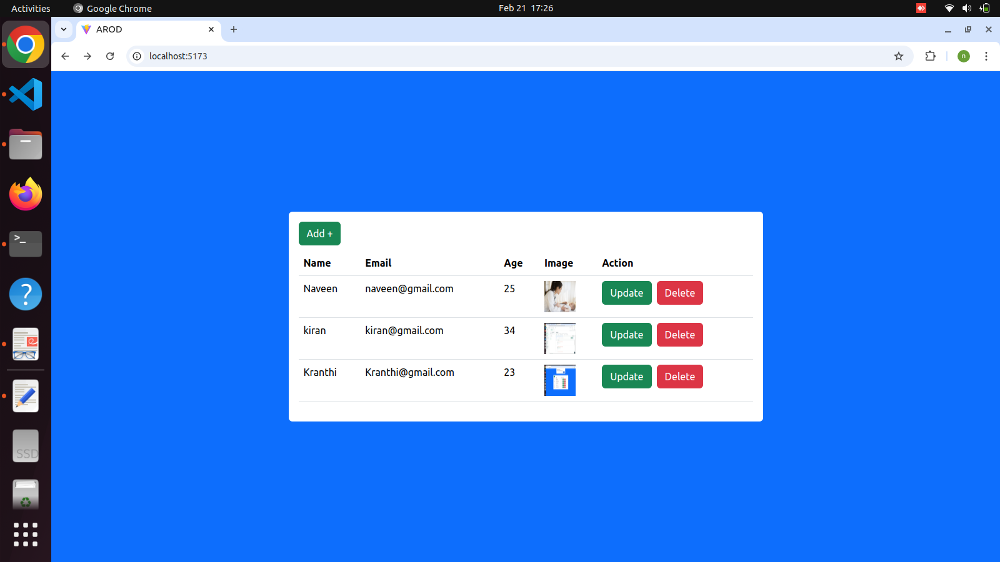
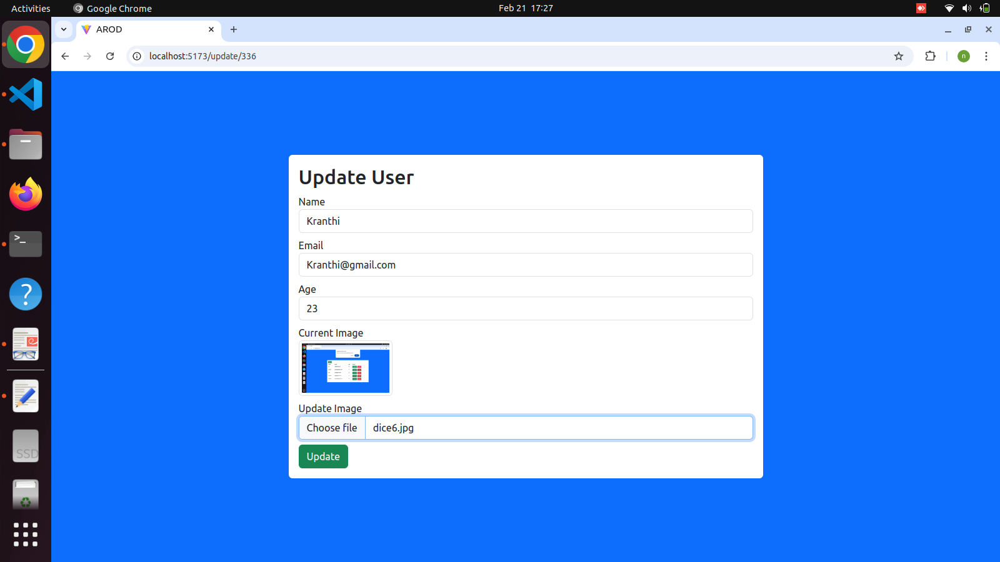
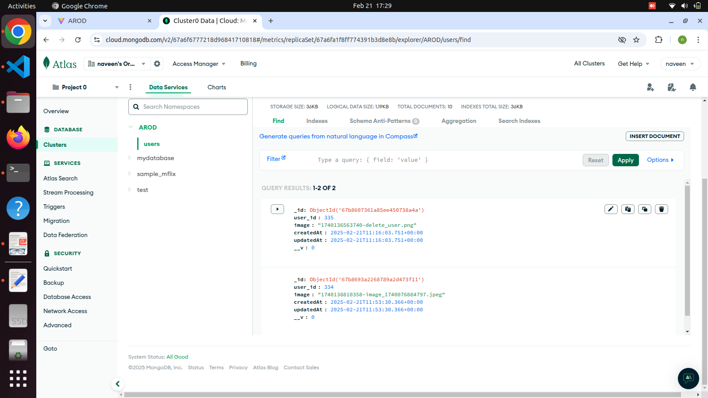
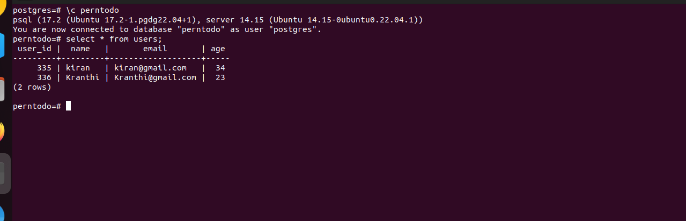

# AROD

## Overview
AROD is a web application built using React.js (initialized with Vite) for the frontend and Node.js with Express for the backend. It is designed to manage various operations efficiently, leveraging modern web development best practices.
User details like name, email, age is stored in Postgresql DB and uploaded image refrence is stored in MongoDB.

## Features
- CRUD operations for managing users
- RESTful API integration with React.js frontend
- State management using React Hooks
- Secure API calls with Axios
- Database management using MongoDB Atlas and Postgresql

## Technologies Used
### Frontend:
- React.js (initialized with Vite)
- Bootstrap for responsive design
- Axios for API requests

### Backend:
- Node.js with Express
- MongoDB Atlas
- Postgresql 

## Installation
### Prerequisites:
Ensure you have the following installed:
- Node.js & npm
- Git
- Postgresql

### Setup Steps:
1. **Clone the repository:**
   ```bash
   git clone https://github.com/medinaveen9/AROD_new.git
   cd AROD_new
2. **Backend Setup:**
   ```bash
   cd server
   npm install
   npm start
3. **Frontend Setup:**
   ```bash
   cd client
   npm install
   npm run dev
4. **Access the Application:**
   - Frontend: http://localhost:5173
   - Mongo API: http://localhost:3001
   - Postgresql API: http://localhost:5000

### API Endpoints:
- Users:
   - GET / - Retrieve all users
      

   - PUT /updateUser/:id - Update a user
      

   - Mongo db Snapshot
      

   - Postgresql db Snapshot
      
